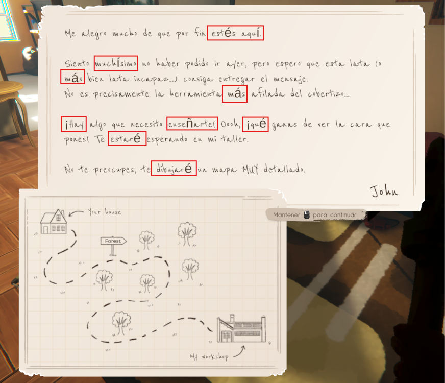

# Notas — Sesión de Playtest

**Juego:** Farmbotic
**Fecha:** 27/08/2026
**Build/Versión:** ??
**Duración de la sesión:** 37 minutos
**Objetivo de esta sesión:** primer contacto, tutorial

---

## Registro

| Hora | Qué hice | Qué pasó | Tipo | Evidencia |
|------|----------|----------|------| ---------- |
| 17:50 | Se realiza la misión de plantar las semillas de trigo | buena mecánica. Problema: consumo excesivo de enegía para una tarea tan simple | funcionamiento | ---------------------------- |
| 18:01 |Se completaron las primeras misiones de la granja | caídas de FPS | Problemas de rendimiento | ---------------------------- |
|18:23 | Buscar completar la misión "Prueba tu nueva cama" | tiempo de carga a la hora de ingresar o salir de la casa | problema de rendimiento | ---------------------------- |
| 18:33 | Momento en que recibimos la carta de John Smith | Errores de formato con la traducción al Españón | Formato / Traducción |

**Tipo** :

- `BUG` → --

- `UX` → cómoda, intuitiva

- `IDEA` → Mejorar el consumo de la energía a la hora de realizar acciones

- `DUDA` → delimitación del tutorial

- `OK` → controles intuitivos y convencionales, lo cual hace más cómoda la experiencia del usuario

---

## Notas generales al cierre de la sesión
Primer contacto con el juego. Se completó parte del tutorial, aunque no quedó claro en ningún momento cuál es el límite entre "tutorial guiado" y "juego libre". No hay una indicación explícita de inicio/fin, lo cual dificulta evaluar si ciertas mecánicas ya deberían conocerse a esta altura o todavía no fueron introducidas.

**Aspectos positivos:**

- La interfaz general resulta intuitiva y cómoda de usar en esta primera impresión

- Los controles, en general, son cómodos e intuitivos para los usuarios

**Problemas detectados:**

- **Formato/traducción:** se observan errores de formato en el texto en español, relacionados con el manejo de caracteres especiales del idioma (ñ, tildes, signos de apertura ¿/¡) que no están contemplados en el sistema de texto original en inglés.

- **Tiempos de carga:** las transiciones entre escenas (ej. entrar/salir de la casa, entrar a la mina) tienen tiempos de carga que resultan tediosos con el uso repetido, afectando el ritmo de juego.

- **Rendimiento:** se registraron caídas de FPS durante la sesión. Falta determinar si están asociadas a zonas/acciones específicas o son generales en todo momento (a confirmar en próxima sesión).

- **Balance de consumo de energía:** tareas de bajo esfuerzo aparente, como plantar semillas, consumen una cantidad de energía notablemente alta, incluso superior a la de correr. Esto genera una desproporción entre el "costo" percibido de la acción y su costo real en el sistema de energía, lo cual puede afectar el ritmo de progresión y la sensación de recompensa del jugador.

---

## Pendientes para la próxima sesión
- Confirmar si el tutorial tiene un cierre explícito (mensaje, pantalla algún indicador) o si termina de forma difusa mezclado con el juego libre.

- Registrar en qué momentos/zonas específicas caen los FPS: ¿es constante en toda la partida o se da en lugares puntuales (ej. mina, exteriores con muchos objetos, ciertos horarios del día in-game)?

- Revisar y catalogar más casos concretos de errores de traducción (capturas de pantalla con el texto exacto mal formateado), para poder armar un bug report con ejemplos puntuales en vez de una observación general.

- Medir/estimar los tiempos de carga entre escenas (con cronómetro o aproximado), para poder cuantificar "tedioso" con un número concreto.

- Explorar mecánicas de automatización del juego (más allá de lo básico), ya que esta sesión se centró en jugabilidad general y rendimiento.

- Probar el sistema de guardado (guardar, salir, volver a cargar) para verificar que no haya pérdida de progreso o corrupción de datos.

- Anotar specs de la PC (CPU, GPU, RAM) al inicio de la próxima sesión, para poder correlacionar el problema de FPS con el hardware.