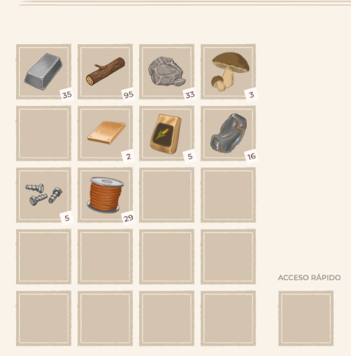
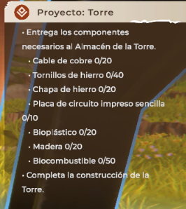

# Farmbotic — Final Playtest Report

## 1. Introduction

This document summarizes the testing performed during the Farmbotic Playtest.

The purpose of the testing was to evaluate the early gameplay experience, identify possible usability and progression issues, verify unexpected behaviors and document observations that could be useful for the development team.

The testing was performed independently through several gameplay sessions, following an exploratory testing approach. The objective was not to search exclusively for bugs, but to experience the game as a player while documenting positive aspects, points of confusion, possible improvements and reproducible problems.

The testing focused mainly on the single-player gameplay available during the Playtest.

---

## 2. Test Environment

### Hardware

* **CPU:** 13th Gen Intel Core i7-13620H
* **CPU Cores:** 10
* **Logical Processors:** 16
* **RAM:** 16 GB DDR4 3200 MT/s
* **GPU:** Intel UHD Graphics
* **Storage:** Samsung 512 GB NVMe SSD
* **Operating System:** Windows 11

### Game

* **Game:** Farmbotic
* **Version:** 0.5.4
* **Platform:** Steam
* **Input:** Keyboard and Mouse
* **Game Mode Tested:** Single-player

---

## 3. Testing Methodology

The testing followed an exploratory approach divided into three sessions.

Rather than repeating the same tests multiple times, each session had a specific objective based on the findings from the previous one.

### SESSION-01 — First-Time User Experience

The first session focused on experiencing the game from the perspective of a new player.

The following areas were explored:

* Main menu.
* Initial gameplay.
* Tutorial.
* Farming mechanics.
* Cave exploration.
* Mission progression.
* Loading transitions.
* Localization.
* Time and sleep mechanics.
* Initial save behavior.

### SESSION-02 — Progression and Save Testing

The second session focused on continuing the progression reached during the first session.

The main areas tested were:

* John / Farmbot mission.
* Main and secondary missions.
* Technology tree.
* Machine instructions.
* Progression requirements.
* Unexpected game closure.
* Save persistence.
* Assembler mission.

### SESSION-03 — Final Verification

The third session was performed as a follow-up to verify whether the most significant progression issue identified during SESSION-02 could be resolved after advancing several in-game days.

The session also investigated the main `Proyecto: Torre` mission and its recognition of required materials.

Testing was concluded after the progression became blocked by multiple issues that could be reproduced or verified during the sessions.

---

# 4. Positive Observations

The purpose of this report is not only to document problems. Several aspects of the game provided a positive experience during testing.

## 4.1 Main Menu

The main menu has a simple and familiar structure.

The buttons are positioned in expected locations and are easy to identify, reducing the amount of time required for the player to understand how to navigate the menu.

The visual presentation was also perceived positively during the first session.

---

## 4.2 Clear Actions During Early Gameplay

During the initial gameplay, many actions were clearly communicated through button prompts and instructions.

When the game explicitly asked the player to perform an action, the required input was generally easy to understand.

This contributed positively to the initial learning process.

One point that should be considered for future testing is whether this clarity remains when tutorials are disabled, as the first session was performed with tutorials enabled.

---

## 4.3 Exploration and Resource Gathering

The game allows the player to freely explore and gather resources.

During the first session, activities such as chopping and mining were enjoyable to perform even when there was not always an immediate understanding of how the collected resources would be used.

This provides a sense of freedom during exploration and gives the player activities to perform outside of the direct mission objectives.

---

## 4.4 Mission Recovery After Fainting

Although the sleep restriction could be frustrating, one positive aspect was observed after the character fainted.

The player was returned to the house while the active mission remained available.

This prevented the mission itself from being completely lost and allowed progression to continue.

---

# 5. UX and Gameplay Observations

The following points were observed during testing but were not necessarily considered confirmed bugs.

## 5.1 Time Management

The character automatically faints after reaching 2:00 AM.

The mechanic appears to be intentional, but during exploration it can become difficult to manage the available time when missions require travelling between several locations.

The player has to keep track of:

* Mission objectives.
* Current location.
* Travel time.
* Energy.
* Time of day.
* Sleep deadline.

During testing, this resulted in having to repeat part of the route through the mine after fainting.

This could become more manageable as the player becomes familiar with the game, but it is worth considering how much information the game provides to help the player plan longer activities.

---

## 5.2 Mission Direction

Several missions provide the objective but do not always indicate where the player should go next.

For example, one mission instructs the player to unlock transport pipes through the technology tree without clearly directing the player to where the technology tree can be accessed.

This can be particularly confusing if the player does not remember the location or functionality from a previous session.

---

## 5.3 Relationship Between Main and Secondary Missions

During testing, some secondary missions appeared to be required before the player could continue with the main `Proyecto: Torre` progression.

This relationship was not immediately obvious.

A player could reasonably interpret a secondary mission as optional content, so clearer communication about dependencies between missions could improve progression clarity.

---

## 5.4 Machine Instructions

Some machines require the player to remember information provided when they were initially introduced.

A possible improvement would be to provide a small help or information section for each machine.

This would allow players to review how a machine works without requiring them to remember a tutorial from a previous session.

This could be particularly useful for players who play for short periods of time or return to the game after several days.

---

## 5.5 Energy Consumption

The energy required for activities such as planting and watering felt relatively high during the early stages of the game.

However, this was not classified as a bug.

Further progression may change the player's available energy, tools or resources, so a balance assessment would require more gameplay than was possible during this Playtest.

This is therefore recorded as a **design observation** rather than a confirmed issue.

---

# 6. Localization Observations

Some localization issues were observed during the first session.

The Spanish text contained formatting and character-related problems in certain locations, including punctuation, accented characters and the use of characters such as `Ñ`.

Some text embedded directly into visual assets also remained in English.

The menu localization appeared more consistent than some of the text encountered during gameplay.

These observations should be reviewed separately from translation accuracy, as some of the issues appeared to be related to localization formatting or character support rather than incorrect translations.

---

# 7. Loading Time Observations

Several loading transitions were measured during the first session.

The observed times varied depending on the transition and situation.

Some transitions took noticeably longer than others, particularly when moving between the farm and other areas.

However, the observed loading times were not considered sufficient on their own to classify the behavior as a confirmed performance bug.

The main observation was that repeated transitions can make progression feel slower, particularly when combined with the game's time-management mechanics.

Further performance testing with additional hardware configurations would be required before drawing broader conclusions.

---

# 8. Confirmed Progression Issues

Two significant progression issues were identified during the testing sessions.

## 8.1 Assembler Mission Cannot Be Completed

During SESSION-02, the mission requiring the construction of the Assembler entered an inconsistent state after an unexpected game closure.

The Assembler remained placed in the game world, but the mission state indicated that the objective had not been completed.

The issue was re-tested during SESSION-03 after advancing three in-game days.

The mission continued to appear.

Multiple attempts were performed, including:

* Keeping the existing Assemblers.
* Destroying the existing Assemblers.
* Sleeping to advance time.
* Constructing another Assembler.
* Restarting the game.

The mission continued to request the same objective and did not progress normally.

### Impact

The player is unable to progress through the affected mission in the current game state.

### Assessment

This is considered a **progression-blocking bug** because the required action can be performed in the game world, but the mission does not correctly recognize the completed state.

A detailed reproduction report should be created separately.

---

## 8.2 Required Materials Not Recognized by `Proyecto: Torre`

During SESSION-03, an additional progression issue was identified in the main `Proyecto: Torre` mission.

The player had the required materials in the inventory, but the mission counter continued to display zero.

For example, the inventory contained **5 iron screws**, while the corresponding mission counter displayed **0**.

Because the mission did not recognize the available materials, progression could not continue.

### Impact

The player is unable to advance through the affected objective despite possessing the required material.

### Assessment

This is considered a **progression-blocking issue involving material recognition**.

Further technical investigation by the development team would be required to determine whether the problem is related to inventory state, item identification or mission-state handling.

---

# 9. Save and Persistence Observations

An unexpected game closure was performed during SESSION-02 to evaluate save persistence.

After restarting the game, some mission progress had not been preserved.

In particular, progress related to the mission requiring the connection of the mining well to the warehouse had to be repeated.

The Assembler issue was also discovered following an unexpected closure, where the physical object remained in the world while the corresponding mission state was not correctly preserved.

This suggests that certain gameplay states may not be synchronized correctly between the world state and mission progression after an unexpected termination.

This area would benefit from additional testing by the development team using different mission states and save conditions.

---

# 10. Improvement Suggestions

Based on the testing performed, the following improvements could help the overall player experience.

### Machine Information

Provide an accessible explanation of how previously unlocked machines work.

### Mission Direction

Consider providing additional contextual information or directions for objectives that require the player to locate a specific system or area.

### Mission Dependencies

Make dependencies between secondary missions and main missions more explicit.

### Mission State Feedback

Provide clearer feedback when a required item has been recognized by a mission.

This could help the player understand whether an item is correctly registered or whether another action is required.

---

# 11. Overall Assessment

The testing sessions provided a positive initial impression of several aspects of Farmbotic, particularly its visual presentation, exploration mechanics and the general clarity of many early interactions.

The game also provides freedom for the player to explore and perform activities outside of the immediate objectives, which can contribute positively to the gameplay experience.

At the same time, progression clarity becomes more important as the player moves beyond the initial tutorial section. Several objectives require the player to remember information or determine the next step without always receiving enough direction.

The most significant findings were related to progression and save-state consistency.

The Assembler mission could not be completed after entering an inconsistent state, even after advancing several in-game days and attempting multiple recovery methods. A separate issue was also identified where required materials were present in the player's inventory but were not recognized by the `Proyecto: Torre` mission.

These issues ultimately prevented further progression through the tested gameplay section.

---

# 12. Testing Conclusion

The gameplay testing stage was concluded after three sessions.

The decision to stop testing was based on the fact that the current gameplay state became blocked by progression issues that could not be resolved through normal player actions.

This does not represent an evaluation of the game as a whole. The testing was limited to the available Playtest build, the tested gameplay section and the specific progression paths reached during the sessions.

The purpose of this report is to provide useful feedback based on actual gameplay observations, including both positive aspects and areas that could benefit from further development.

The identified progression issues should be investigated by the development team, particularly the synchronization between mission states, inventory items and saved world objects.

Overall, the testing provided a useful representation of the current gameplay experience and identified several areas where improvements could make progression clearer and more reliable for players.
