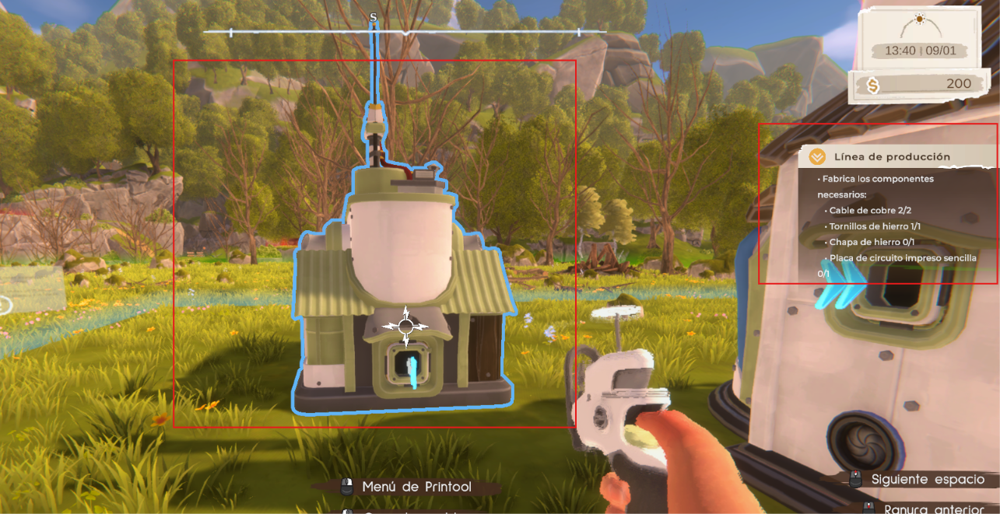
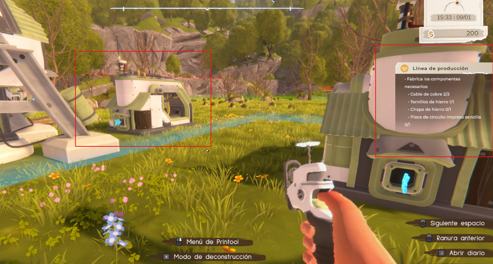

objetivo de hoy:
- completar la misión de John
- Ver el resto de misiones y su jugabilidad
- Exploración libre
- Salida repentina del juego (ver el autoguardado)

----
La misión de John consiste en esperar unos días, pero si dormis pasa esos día. Me di cuenta proque al iniciar nuevamente la sesión decía día 1/2 y yo estaba en la cama.
- no tiene sentido que se diga: visita a John, pero que el esté en nuestra granja (puede ser un error de traducción, hay que comprobar)
- la misión estuvo sencilla
- Es muy frustrante el tema del sueño del personaje ya que llega las 2 y se desmaya, así que ahora tengo que volver a hacer todo el recorrido de la mina para llegar a ello. Es como que hay que estar atento a muchas cosas

- Una de las misiones dice: Desbloquea tuberías de transporte en el árbol tecnológico. Pero no te direcciona dónde ir. Es confuso en caso de que tengas mala memoria
- La misión dónde hay que conectar el pozo minero con el almacén también es confusa al inicio
- Cuando seleccioné la misión de la torre, a pesar de que tenía materiales (Por ejemplo: cable de cobre) no me contaba como que tuviera, por ese motivo no pude avanzar con la misión principal

- Sugerencia: creo que estaría bueno que en las máquinas haya un apartado de cómo usarlas por cuestiones de practicidad y eficiencia en caso de olvidos. Por ejemplo, el usuario un día juega pero está muy cansado y sabe que solo tiene el tutorial de uso una sola vez, es frustrante para el usuario

- hice la prueba de cierre brusco. Resultado: tengo que volver a terminar la misión de conectar el pozo minero al almacén
- Problema: hay que hacer las misiones secundarias de forma obligatoria para poder hacer la misión principal de la torre
- Fui a dormir mientras había la misión de colocar el Ensamblador y se me quedó la pantalla negra. Tuve que salir del juego obligatoriamente y no se me guardó el progreso de la misión, tuve que volver a la parte de desbloquear el ensamblador, pero tenía el ensamblador colocado, aunque destruya el que ya tengo, no me permite avanzar de la misión, se quedó como que nunca fabrico el Ensamblador
Pruebas visuales:

- Puse el nuevo Ensamblador y me sigue apareciendo la misma misión

- He intentado salir y volver a entrar pero el error no se soluciona