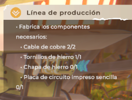

# SESSION-03 — Session Report

## Session Information

* **Session ID:** SESSION-03
* **Date:** 12/09/2026
* **Game:** Farmbotic
* **Game Version:** 0.5.4
* **Testing Type:** Follow-up Testing / Verification Testing
* **Primary Focus:** Verification of the Assembler mission issue
* **Additional Focus:** Main mission progression and material recognition

---

## Session Objective

The main objective of this session was to verify whether the issue found during SESSION-02 with the Assembler mission could be resolved after advancing several in-game days.

The session also included a final attempt to continue the main progression through the `Proyecto: Torre` mission and verify whether the required materials were correctly recognized by the mission.

This session was intended as a final verification of the progression issues identified during the previous testing sessions.

---

## Assembler Mission — Final Verification

Three in-game days after the previous session, the game was launched again to verify whether the issue affecting the Assembler mission had been resolved.

Upon entering the game, the Assembler mission was still displayed even though two Assemblers had already been constructed during the previous session and remained saved in the game world.

Several attempts were made to determine whether the mission could be completed normally.

First, both existing Assemblers were destroyed and the character went to sleep. After advancing time, the mission continued to request the same objective.

A second attempt was made by keeping the two existing Assemblers and constructing an additional one. After completing the required action, the mission did not progress correctly and returned to requesting the construction of another Assembler.

The problem therefore remained after multiple attempts and after advancing several in-game days.

Based on the tests performed across SESSION-02 and SESSION-03, the mission is considered **blocked in the current game state**, as the player is unable to complete the objective despite having constructed the required object.

---

## `Proyecto: Torre` — Material Recognition

After determining that the Assembler mission could not be progressed, an attempt was made to continue with the main mission `Proyecto: Torre`.

The required materials were prepared in order to advance the mission.

However, the mission counter continued to display `0` for the required materials, despite the materials being present in the player's inventory.

In the captured example, the inventory contains **5 iron screws**, while the mission continues to display a value of **0** for the same material.

Because the mission does not recognize the available materials, progression through the objective cannot continue.

This indicates a second progression-related issue involving the recognition of required materials.

---

## Final Testing Assessment

At this point, the main progression path available during the tested gameplay section was blocked by two different issues:

* The Assembler mission could not be completed despite constructing the required object multiple times.
* The `Proyecto: Torre` mission did not recognize required materials that were already present in the player's inventory.

Both issues prevented further progression through the tested section of the game.

The Assembler issue was specifically re-tested after advancing three in-game days and remained present, providing additional evidence that the problem was not simply related to waiting for the mission to update.

The material recognition issue in `Proyecto: Torre` also prevented further progression, as the mission counter remained at zero despite the required items being available.

---

## Conclusion of Gameplay Testing

Due to the progression blockers encountered during SESSION-02 and verified during this session, this testing stage of the Farmbotic gameplay is considered complete.

The decision to conclude testing at this point is not intended as an evaluation of the game as a whole. The testing was limited to the gameplay and progression available during the sessions performed, and several positive aspects of the experience were also identified during earlier testing sessions.

The purpose of concluding the testing at this stage is to document the issues encountered and provide reproducible information that may help identify and resolve them, rather than continuing to test beyond a point where the current game state prevents normal progression.

The next stage of the project will therefore focus on organizing the findings from all three sessions into individual bug reports, improvement suggestions and a final testing report.

---

## Overall Testing Cycle

The three sessions covered different aspects of the gameplay:

### SESSION-01 — First-Time User Experience

Focused on the initial experience, including:

* Main menu and initial interaction.
* Tutorial and early progression.
* Initial farming activities.
* Cave exploration.
* Loading transitions.
* Localization observations.
* Mission and progression clarity.
* Time and sleep mechanics.
* Initial save behavior.

### SESSION-02 — Progression and Save Testing

Focused on continuing beyond the initial gameplay and investigating:

* John / Farmbot mission.
* Mission progression.
* Relationship between secondary and main missions.
* Technology tree.
* Machine instructions.
* Unexpected game closure.
* Save persistence.
* Assembler mission progression.

### SESSION-03 — Final Verification

Focused on:

* Re-testing the Assembler mission after advancing three in-game days.
* Attempting different ways to complete the Assembler objective.
* Verifying whether the progression issue persisted.
* Testing the `Proyecto: Torre` mission.
* Verifying whether required materials were correctly recognized.
* Determining whether the current gameplay progression could continue.

With these tests completed, the gameplay testing phase of the project is considered finished.
